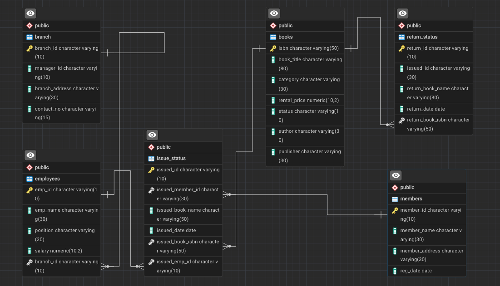

# Library Management System using SQL Project

## Project Overview

**Project Title**: Library Management System  
**Level**: Intermediate  
**Database**: `Library_System_Management`

This project demonstrates the implementation of a Library Management System using SQL. It includes creating and managing tables, performing CRUD operations, CTAS operations, and executing SQL queries for data analysis.

The goal is to showcase skills in database design, data manipulation, and SQL querying.


---

## Objectives

1. **Set up the Library Management System Database**: Create and populate the database with tables for branches, employees, members, books, issued status, and return status.
2. **CRUD Operations**: Perform Create, Read, Update, and Delete operations on the data.
3. **CTAS (Create Table As Select)**: Utilize CTAS to create new tables based on query results.
4. **SQL Data Analysis**: Develop SQL queries to analyze and retrieve specific data from the library database.

---

## Project Structure


### 1. Database Setup

The Library Management System database contains tables for:

- Branches
- Employees
- Members
- Books
- Issued Status
- Return Status

The tables are connected using Primary Keys and Foreign Keys to establish relationships between the different entities.

### Database Creation

The database used for this project is:

```sql
CREATE DATABASE Library_System_Management;
```

### Tables Created

#### Branch Table

Stores information about different library branches.

```sql
CREATE TABLE branch
(
    branch_id VARCHAR(10) PRIMARY KEY,
    manager_id VARCHAR(10),
    branch_address VARCHAR(30),
    contact_no VARCHAR(15)
);
```

#### Employees Table

Stores information about library employees.

```sql
CREATE TABLE employees
(
    emp_id VARCHAR(10) PRIMARY KEY,
    emp_name VARCHAR(30),
    position VARCHAR(30),
    salary DECIMAL(10,2),
    branch_id VARCHAR(10),
    FOREIGN KEY (branch_id) REFERENCES branch(branch_id)
);
```

#### Members Table

Stores information about library members.

```sql
CREATE TABLE members
(
    member_id VARCHAR(10) PRIMARY KEY,
    member_name VARCHAR(30),
    member_address VARCHAR(30),
    reg_date DATE
);
```

#### Books Table

Stores information about books available in the library.

```sql
CREATE TABLE books
(
    isbn VARCHAR(50) PRIMARY KEY,
    book_title VARCHAR(80),
    category VARCHAR(30),
    rental_price DECIMAL(10,2),
    status VARCHAR(10),
    author VARCHAR(30),
    publisher VARCHAR(30)
);
```

#### Issued Status Table

Stores information about books issued to members.

```sql
CREATE TABLE issued_status
(
    issued_id VARCHAR(10) PRIMARY KEY,
    issued_member_id VARCHAR(30),
    issued_book_name VARCHAR(80),
    issued_date DATE,
    issued_book_isbn VARCHAR(50),
    issued_emp_id VARCHAR(10),
    FOREIGN KEY (issued_member_id) REFERENCES members(member_id),
    FOREIGN KEY (issued_emp_id) REFERENCES employees(emp_id),
    FOREIGN KEY (issued_book_isbn) REFERENCES books(isbn)
);
```

#### Return Status Table

Stores information about returned books.

```sql
CREATE TABLE return_status
(
    return_id VARCHAR(10) PRIMARY KEY,
    issued_id VARCHAR(30),
    return_book_name VARCHAR(80),
    return_date DATE,
    return_book_isbn VARCHAR(50)
);
```

---

## 2. CRUD Operations

CRUD stands for:

- **Create**: Insert new records
- **Read**: Retrieve existing records
- **Update**: Modify existing records
- **Delete**: Remove existing records

The project demonstrates CRUD operations using the Library Management System database.

---

### Task 1. Create a New Book Record

Inserted a new book record into the `books` table.

```sql
INSERT INTO books
(
    isbn,
    book_title,
    category,
    rental_price,
    status,
    author,
    publisher
)
VALUES
(
    '978-1-60129-456-2',
    'To Kill a Mockingbird',
    'Classic',
    6.00,
    'yes',
    'Harper Lee',
    'J.B. Lippincott & Co.'
);

SELECT * FROM books;
```

---

### Task 2. Update an Existing Member's Address

Updated the address of an existing library member.

```sql
UPDATE members
SET member_address = '125 Oak St'
WHERE member_id = 'C103';
```

---

### Task 3. Delete a Record from the Issued Status Table

Deleted a record from the `issued_status` table using the `issued_id`.

```sql
DELETE FROM issued_status
WHERE issued_id = 'IS121';
```

---

### Task 4. Retrieve All Books Issued by a Specific Employee

Retrieved all books issued by the employee with `emp_id = 'E101'`.

```sql
SELECT *
FROM issued_status
WHERE issued_emp_id = 'E101';
```

---

### Task 5. List Members Who Have Issued More Than One Book

Used `GROUP BY` and `HAVING` to identify members who have issued more than one book.

```sql
SELECT
    issued_member_id,
    COUNT(*) AS total_books_issued
FROM issued_status
GROUP BY issued_member_id
HAVING COUNT(*) > 1;
```

---

## 3. CTAS (Create Table As Select)

### Task 6. Create Summary Tables

Used CTAS to generate a new summary table containing each book and the total number of times it has been issued.

```sql
CREATE TABLE book_issued_cnt AS
SELECT
    b.isbn,
    b.book_title,
    COUNT(ist.issued_id) AS issue_count
FROM issued_status AS ist
JOIN books AS b
    ON ist.issued_book_isbn = b.isbn
GROUP BY
    b.isbn,
    b.book_title;
```

The resulting table can be viewed using:

```sql
SELECT * FROM book_issued_cnt;
```

---

## 4. Data Analysis & Findings

The following SQL queries were used to retrieve and analyze information from the Library Management System.

---

### Task 7. Retrieve All Books in a Specific Category

Retrieved all books belonging to the `Classic` category.

```sql
SELECT *
FROM books
WHERE category = 'Classic';
```

---

### Task 8. Find Total Rental Income by Category

Calculated rental income and the number of issued books for each category.

```sql
SELECT
    b.category,
    SUM(b.rental_price) AS total_rental_income,
    COUNT(*) AS total_books_issued
FROM issued_status AS ist
JOIN books AS b
    ON b.isbn = ist.issued_book_isbn
GROUP BY b.category;
```

---

### Task 9. List Members Who Registered in the Last 180 Days

Used PostgreSQL date functions to identify members who registered within the last 180 days.

```sql
SELECT *
FROM members
WHERE reg_date >= CURRENT_DATE - INTERVAL '180 days';
```

Additional sample members can be inserted to test the query:

```sql
INSERT INTO members
(
    member_id,
    member_name,
    member_address,
    reg_date
)
VALUES
(
    'C120',
    'Brian',
    '422 Elm St',
    '2026-06-01'
),
(
    'C121',
    'Mike',
    '101 Main St',
    '2026-05-01'
);
```

---

### Task 10. List Employees with Their Branch Manager's Name and Branch Details

Used multiple `JOIN` operations to retrieve employee, branch, and manager information.

```sql
SELECT
    e1.emp_id,
    e1.emp_name,
    e1.position,
    e1.salary,
    b.*,
    e2.emp_name AS manager
FROM employees AS e1
JOIN branch AS b
    ON e1.branch_id = b.branch_id
JOIN employees AS e2
    ON e2.emp_id = b.manager_id;
```

---

### Task 11. Create a Table of Books with Rental Price Above a Certain Threshold

Used CTAS to create a table containing books with a rental price greater than 7.

```sql
CREATE TABLE expensive_books AS
SELECT *
FROM books
WHERE rental_price > 7.00;
```

The resulting table can be viewed using:

```sql
SELECT *
FROM expensive_books;
```

---

### Task 12. Retrieve the List of Books Not Yet Returned

Used a `LEFT JOIN` to identify issued books that do not have a corresponding return record.

```sql
SELECT *
FROM issued_status AS ist
LEFT JOIN return_status AS rs
    ON rs.issued_id = ist.issued_id
WHERE rs.return_id IS NULL;
```

---

## SQL Concepts Used

This project demonstrates the following SQL concepts:

- Database Design
- Primary Keys
- Foreign Keys
- Table Relationships
- `CREATE TABLE`
- `INSERT`
- `SELECT`
- `UPDATE`
- `DELETE`
- `WHERE`
- `GROUP BY`
- `HAVING`
- `COUNT()`
- `SUM()`
- `JOIN`
- `LEFT JOIN`
- CTAS (`CREATE TABLE AS SELECT`)
- Date Functions
- `CURRENT_DATE`
- `INTERVAL`
- Data Filtering
- Data Aggregation

---

## Project Files

### `schemas.sql`

Contains SQL statements used to create the database tables and establish relationships between them.

### `insert_queries.sql`

Contains SQL statements used to insert the provided library dataset into the database.

### `queries.sql`

Contains SQL queries used for CRUD operations, CTAS operations, joins, aggregation, filtering, and data analysis.

### `data/`

Contains the CSV files used as the source data for the project.

The folder contains:

- `books.csv`
- `branch.csv`
- `employees.csv`
- `issued_status.csv`
- `members.csv`
- `return_status.csv`

---

## Reports

The project provides analysis related to:

- Database schema and table relationships
- Books and their categories
- Rental prices
- Book issue records
- Member registration dates
- Employee and branch information
- Books that have not yet been returned
- Book issue counts

---

## How to Use

### 1. Clone the Repository

Clone this repository to your local machine:

```bash
git clone https://github.com/Hrithikdoi/Library-System-Management.git
```

Navigate into the project directory:

```bash
cd Library-System-Management
```

---

### 2. Set Up the Database

Create the PostgreSQL database:

```sql
CREATE DATABASE library_db;
```

Connect to the `library_db` database.

Execute the SQL statements from:

```text
schemas.sql
```

This will create the required tables and relationships.

---

### 3. Insert the Data

Execute:

```text
insert_queries.sql
```

This will populate the tables with the library dataset.

---

### 4. Run the Queries

Execute the SQL queries from:

```text
queries.sql
```

These queries perform CRUD operations, CTAS operations, joins, aggregations, filtering, and other data analysis tasks.

---

### 5. Explore and Modify

You can customize the queries and explore different aspects of the library database or create additional queries for further analysis.

---

## Project Status

### Completed

- Database setup
- Table creation
- Primary keys
- Foreign key relationships
- Data insertion
- CRUD operations
- CTAS operations
- Data filtering
- Data aggregation
- JOIN operations
- LEFT JOIN operations
- Date-based analysis
- ER diagram

### Future Improvements

Additional advanced SQL analysis and database operations can be added as the project progresses.

---

## Conclusion

This project demonstrates the application of SQL skills in creating and managing a Library Management System.

It includes database setup, data manipulation, CRUD operations, CTAS, joins, aggregation, and data analysis, providing a practical foundation for database management and SQL analysis.

---

## Author

**Hrithik Doiphode**

GitHub:  
https://github.com/Hrithikdoi

---

Thank you for checking out this project!
